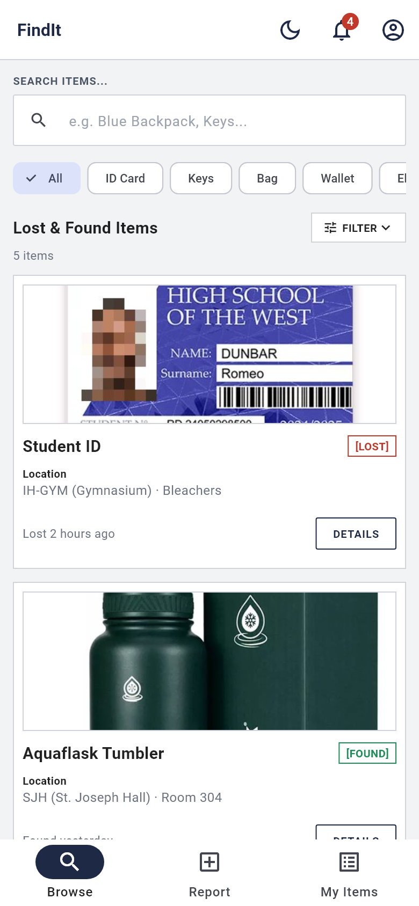
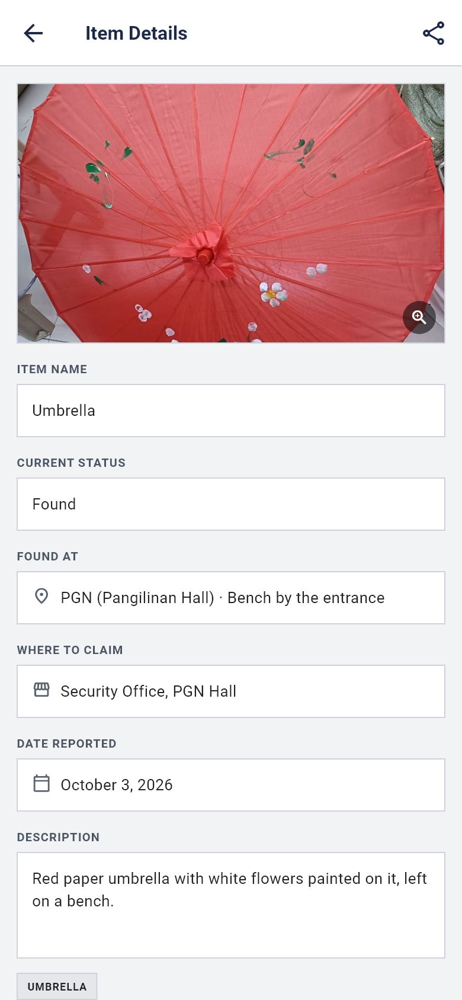
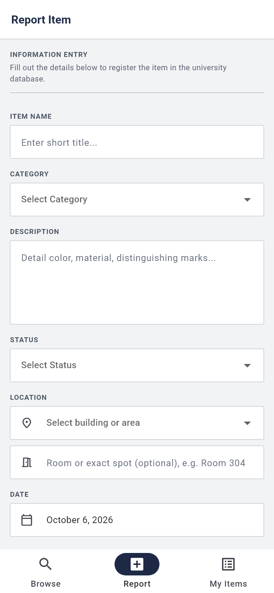

# FindIt

> A campus lost-and-found app for Holy Angel University students: report what you lost or found, browse what others reported, and message the finder or owner to get it back.

**Live demo:** https://aioicchi.github.io/HAU-6ADET-FindIt/
**Demo login:** `student@hau.edu.ph` / `password` (or register a new account)
**Demo video:** `docs/demo.mp4` (link it here once it exists)
**Course:** Applications Development and Emerging Technologies (6ADET), Holy Angel University
**Author:** [aioicchi](https://github.com/aioicchi)

This repository lives in the author's own GitHub account and is public on
purpose. There is no `student.json` here and there should not be one: see
`docs/06-security-and-privacy.md` for what a public repo means for secrets and
personal data.

---

## Screenshots

<!-- TODO: add 2-3 phone-size screenshots to docs/assets/ and uncomment the table.
| Home | Item details | Report item |
| --- | --- | --- |
|  |  |  |
-->

_Screenshots coming soon._

## What it does

- **Browse and search** every lost and found report on campus, and filter by category, Lost or Found, and location, sort by date, or include resolved items.
- **Report an item** with a name, category, description, location, date and a photo taken with the camera or picked from the gallery.
- **View item details**, with a full-screen photo you can zoom, then **message the owner or finder** to arrange a return. Contact details stay private.
- **Manage your own reports** in My Items: edit, mark as resolved, reopen, delete, and see how many inquiries each one got.
- **Notifications** for possible matches and new inquiries, plus a profile you can edit.

## Built with

| | |
| --- | --- |
| Framework | Flutter (Dart) |
| State | One `ChangeNotifier` store (`lib/data/app_store.dart`) read with `ListenableBuilder` |
| Storage | In memory only, seeded with demo data from `lib/data/mock_data.dart` (see Status) |
| Other packages | `image_picker` for camera and gallery photos |

## Running it yourself

```bash
flutter pub get
flutter run -d chrome
```

Or serve it for any browser with `flutter run -d web-server --web-port 8080`
and open http://localhost:8080. Built with Flutter 3.47.5.

On Windows, turn on **Developer Mode** first (`start ms-settings:developers`),
because Flutter needs it to build apps that use plugins such as `image_picker`.

This app needs no API keys, so there is no `.env` to set up.

## Privacy and secrets

- FindIt has no backend: accounts, reports, photos and messages stay in the
  browser's memory and are gone when the page reloads. Nothing is sent to a server.
- There are no secrets or API keys in this project.
- All sample data is fictional (demo user "Juan Dela Cruz", made-up IDs and
  phone numbers), and the one real-looking face in the sample photos is pixelated.
  A reporter's contact info is never shown to other users in the app.

## Project documentation

| Document | |
| --- | --- |
| [Proposal](docs/01-proposal.md) | the problem, the users, the scope |
| [Mockup and wireframes](docs/02-mockup.md) | what it looks like, and the screen flow |
| [Design system](docs/03-design-system.md) | colors, type, spacing, components |
| [Weekly reports](docs/04-weekly-reports.md) | what happened each week |
| [Demo video](docs/05-demo-video.md) | the recording and what it shows |
| [Security and privacy](docs/06-security-and-privacy.md) | the checklist, filled in |

## Status and what is next

**Works:** login and register, browse/search with category, status, location,
sort and resolved filters, report and edit items with
photos and categories, item details with a zoomable photo, chat, My Items
(resolve, reopen, delete), notifications, edit profile.

**Known issues:**
- Data is not saved: everything resets when the page reloads.
- Chat is one-way; no one replies yet, and every message counts as a new inquiry.
- "Forgot password" only shows a confirmation; no email is sent.
- The "possible match" notification is part of the demo data, not computed.

**Next:** save data with Firebase or Supabase, a "claim this item" flow where the
finder verifies the claimer, and automatic matching between lost and found reports.

## Credits

- Packages: see `pubspec.yaml`
- Sample item photos in `assets/images/` were taken from the web for demo
  purposes only (Aquaflask product photo, sample ID card designs, umbrella and
  key photos). <!-- TODO: add the source link for each photo -->

## AI use


<!-- TODO: in your own words, say how much of the work Claude touched. -->
I used Claude (Claude Code) while building this app. The full account of what it
did, where it was wrong, and which parts I wrote myself is in [AI-USAGE.md](AI-USAGE.md).

## Licence

MIT, see [LICENSE](LICENSE). Change it if you want different terms.
