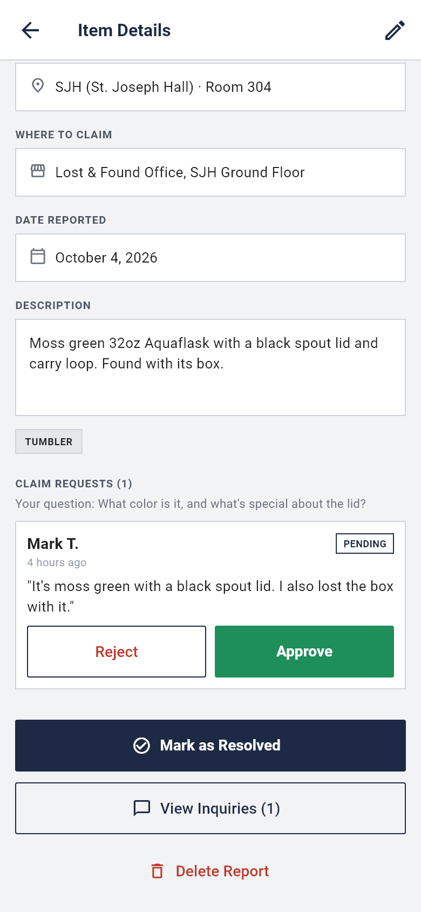
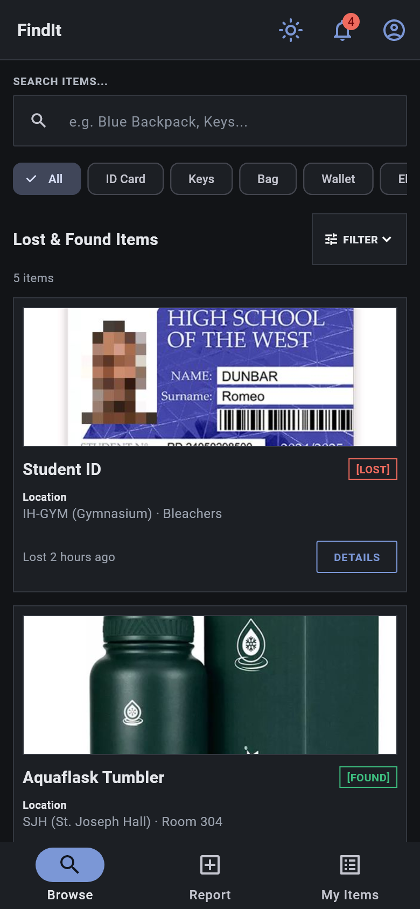

# FindIt

> A campus lost-and-found app for Holy Angel University students: report what you lost or found, browse what others reported, and message the finder or owner to get it back.

**Live demo:** https://aioicchi.github.io/HAU-6ADET-FindIt/
**Demo login:** `student@hau.edu.ph` / `password` (or register a new account)
**Demo video:** `docs/demo.mp4` (link it here once it exists)
**Course:** Applications Development and Emerging Technologies (6ADET), Holy Angel University
**Author:** [aioicchi](https://github.com/aioicchi)

This repository lives in the author's own GitHub account and is public on
purpose. There is no `student.json` here and there should not be one: see
`docs/06-security-and-privacy.md` for what a public repo means for secrets and
personal data.

---

## Screenshots

| Browse | Item details | Claim requests |
| :---: | :---: | :---: |
|  |  |  |

| Report an item | Night mode |
| :---: | :---: |
|  |  |

Screenshots are rendered from the app itself with the demo data:
`flutter test tool/screenshots_test.dart --update-goldens` regenerates them.

## What it does

- **Quick intro** on first launch: three slides (Browse, Report, Claim) with Skip. Profile > How FindIt Works shows them again.
- **Browse and search** every lost and found report on campus, and filter by category, Lost or Found, and location, sort by date, or include resolved items.
- **Report an item** with a name, category, description, date, a photo taken with the camera or picked from the gallery, and where it was: a campus building picked from a list (or "Other…") plus an optional room or exact spot.
- **View item details**, with a full-screen photo you can zoom and, for found items, where to claim it. Then **message the owner or finder** to arrange a return. Contact details stay private.
- **Claim a found item:** answer the finder's verification question (e.g. "What name is printed on the card?"). The finder approves or rejects, and an approved claim tells you where to pick it up. Finders review claims on their own reports, and approving one marks the item resolved.
- **Share a report** to a class or org group chat: the Share button builds a ready-to-paste message (what, where, when, and a link that opens that report on FindIt), using the phone's share sheet or Copy. Contact info is never included.
- **Automatic matching:** when you report an item, FindIt looks for reports on the other side (lost vs found) with the same category or a similar name, notifies you, and lists them under "Possible matches".
- **Manage your own reports** in My Items: edit, mark as resolved, reopen, delete, and see how many people asked about each one.
- **Notifications** for possible matches and new replies, plus a profile you can edit.
- **Pull to refresh** on Browse and My Items (with a mouse on a laptop too), and small animations (cards fade in, a card's photo grows into the details page and then full screen) that switch off when the device asks for reduced motion.
- **Accessible:** every button has a screen-reader label that says what it does ("View details for Umbrella"), tap targets are at least 48×48, and text meets WCAG contrast in both day and night mode. `test/accessibility_test.dart` checks this on eight screens in both modes.
- **Night mode:** tap the moon on the Home screen, or pick System / Light / Dark under Profile > Appearance. The choice is remembered.

## Built with

| | |
| --- | --- |
| Framework | Flutter (Dart) |
| State | One `ChangeNotifier` store (`lib/data/app_store.dart`) read with `ListenableBuilder` |
| Storage | `shared_preferences` (browser storage on the web), seeded with demo data from `lib/data/mock_data.dart` |
| Other packages | `image_picker` for camera and gallery photos, `shared_preferences` to save data on the device |

## Running it yourself

```bash
flutter pub get
flutter run -d chrome
```

Or serve it for any browser with `flutter run -d web-server --web-port 8080`
and open http://localhost:8080. Built with Flutter 3.47.5.

On Windows, turn on **Developer Mode** first (`start ms-settings:developers`),
because Flutter needs it to build apps that use plugins such as `image_picker`.

This app needs no API keys, so there is no `.env` to set up.

## Privacy and secrets

- FindIt has no backend: accounts, reports, photos and messages are saved only
  in your own browser (or on your device), and nothing is sent to a server.
  Profile > Reset Demo Data deletes it all.
- Because this is a demo, passwords are saved in browser storage as plain text.
  Don't use a real password when you register.
- There are no secrets or API keys in this project.
- All sample data is fictional (demo user "Juan Dela Cruz", made-up IDs and
  phone numbers), and the one real-looking face in the sample photos is pixelated.
  A reporter's contact info is never shown to other users in the app.

## Project documentation

| Document | |
| --- | --- |
| [Proposal](docs/01-proposal.md) | the problem, the users, the scope |
| [Mockup and wireframes](docs/02-mockup.md) | what it looks like, and the screen flow |
| [Design system](docs/03-design-system.md) | colors, type, spacing, components |
| [Weekly reports](docs/04-weekly-reports.md) | what happened each week |
| [Demo video](docs/05-demo-video.md) | the recording and what it shows |
| [Security and privacy](docs/06-security-and-privacy.md) | the checklist, filled in |

## Status and what is next

**Works:** login and register, browse/search with category, status, location,
sort and resolved filters, report and edit items with
photos, categories and claim locations, item details with a zoomable photo,
automatic lost/found matching, claiming with a verification question and
approve/reject, chat with simulated replies, night mode, My Items
(resolve, reopen, delete), notifications, edit profile. Everything is saved on
the device and survives a page reload; Profile > Reset Demo Data starts over.

**Known issues:**
- Data is saved per browser, not shared: other users can't see your reports.
- Browser storage holds about 5 MB. If many photos don't fit, the reports are
  still saved but those photos disappear on reload.
- Chat replies and the finder's claim decisions on other people's reports are
  simulated (a short script, and a check that the answer mentions at least two
  details from the description), because there is no shared server for real
  users to talk through.
- "Forgot password" only shows a confirmation; no email is sent.

**Next:** a shared online database so all users see the same reports, real
claims and real-time chat between users.

## Credits

- Packages: see `pubspec.yaml`
- Sample item photos in `assets/images/` were taken from the web for demo
  purposes only (Aquaflask product photo, sample ID card designs, umbrella and
  key photos). <!-- TODO: add the source link for each photo -->

## AI use


<!-- TODO: in your own words, say how much of the work Claude touched. -->
I used Claude (Claude Code) while building this app. The full account of what it
did, where it was wrong, and which parts I wrote myself is in [AI-USAGE.md](AI-USAGE.md).

## Licence

MIT, see [LICENSE](LICENSE). Change it if you want different terms.
